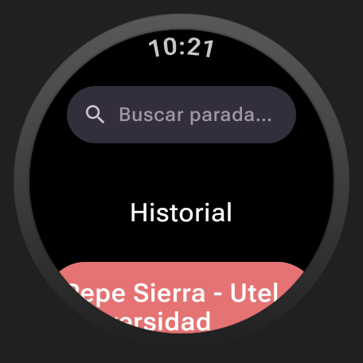
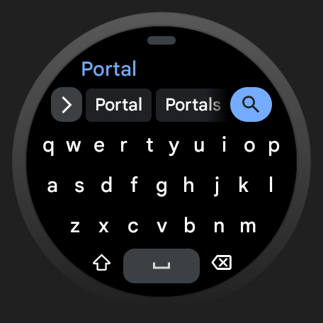
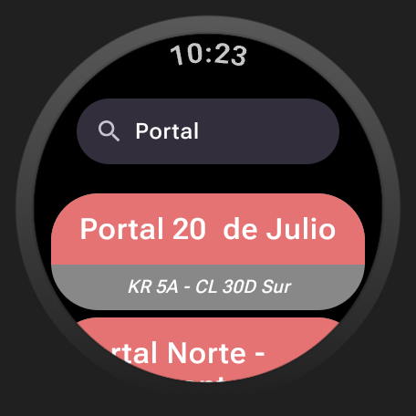
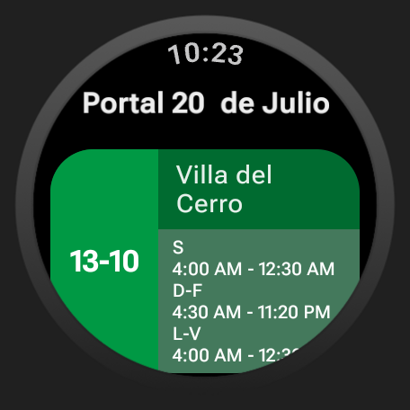
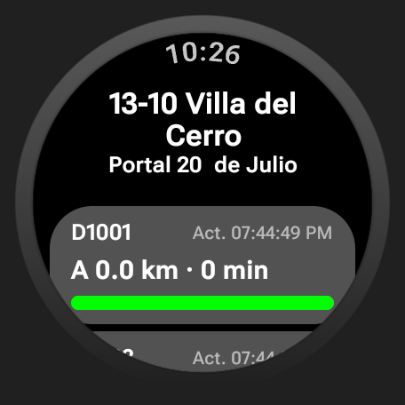

<p align="center">
  
</p>

# ¿Qué es TransmiClock?
TransmiClock es una aplicación de código abierto para Wear OS que permite consultar en tiempo real los buses disponibles en cualquier parada de Bogotá, directamente desde tu reloj inteligente, sin necesidad de sacar el celular.

## Capturas de pantalla

<table>
  <tr>
    <td></td>
    <td><b>Pantalla principal</b><br/>Muestra las paradas guardadas en tu historial. Toca cualquiera para ver sus rutas disponibles de inmediato.</td>
  </tr>
  <tr>
    <td></td>
    <td><b>Búsqueda de parada</b><br/>Toca la barra de búsqueda para abrir el teclado e ingresa el nombre o código de la parada.</td>
  </tr>
  <tr>
    <td></td>
    <td><b>Resultados de búsqueda</b><br/>Se muestran las paradas que coinciden con tu búsqueda. Toca una parada para ver todas las rutas que la sirven.</td>
  </tr>
  <tr>
    <td></td>
    <td><b>Rutas por parada</b><br/>Muestra todas las rutas disponibles en la parada seleccionada. Toca una ruta para consultar la ubicación en tiempo real de sus buses.</td>
  </tr>
  <tr>
    <td></td>
    <td><b>Ubicación en tiempo real</b><br/>Consulta los buses disponibles y su distancia aproximada a la parada. <br/><br/>💡 <i>Desliza desde arriba hacia abajo para recargar la información sin salir de la pantalla.</i></td>
  </tr>
</table>

---

# Requisitos
- Reloj inteligente con **Wear OS 3.0 o superior** (API 30+)

---

# Aviso legal
Esta aplicación ***NO*** está afiliada ni es respaldada oficialmente por TransMilenio S.A. ni por la Secretaría de Movilidad de Bogotá.

Hace uso de APIs internas descubiertas mediante ingeniería inversa de la aplicación oficial de TransMilenio. El uso de estas APIs es bajo su propia responsabilidad.

Los endpoints de dichas APIs no están incluidos en este repositorio. Sin embargo, los [releases oficiales](https://github.com/elczar/TransmiClock/releases) incluyen los secrets compilados y no requieren configuración adicional para su uso.

---

# Instalación

## Descarga
La forma más sencilla de instalar TransmiClock es descargar el APK firmado desde los [releases oficiales](https://github.com/elczar/TransmiClock/releases) e instalarlo mediante ADB.

## Instalación mediante ADB

### 1. Instalar ADB

<details>
<summary>Linux</summary>

```bash
# Debian/Ubuntu
sudo apt install adb

# Arch/CachyOS
sudo pacman -S android-tools

# Fedora/RHEL/CentOS
sudo dnf install android-tools
```

</details>

<details>
<summary>Windows</summary>

Descarga el [SDK Platform Tools](https://developer.android.com/studio/releases/platform-tools) de Android y agrégalo al PATH.

</details>

<details>
<summary>macOS</summary>

```bash
brew install android-platform-tools
```

</details>

<details>
<summary>Android</summary>

La forma más sencilla de instalar TransmiClock desde Android es usando [Wear Installer 2](https://play.google.com/store/apps/details?id=org.freepoc.wearinstaller2), una aplicación gratuita que permite instalar APKs en tu reloj directamente desde el teléfono, sin necesidad de un computador.

**Antes de comenzar**, activa la depuración en tu reloj siguiendo el paso 2 de esta guía.

1. Descarga e instala **Wear Installer 2** en tu teléfono.
2. Abre la app e ingresa la dirección IP de tu reloj en el campo inferior y presiona **DONE**.
3. Toca los tres puntos en la esquina superior derecha y selecciona **Pair with watch**.
4. En la sección inferior presiona **ENABLE** e ingresa el **código de emparejamiento**, un espacio, y el **puerto de emparejamiento** que aparecen en tu reloj. Luego presiona **DONE**.
5. Es posible que debas esperar unos minutos hasta que el emparejamiento se complete y seas devuelto a la pantalla principal.
6. Ingresa el **puerto de conexión** que aparece en la pantalla principal de depuración inalámbrica de tu reloj y presiona **DONE**.
7. Toca **Custom APK** en la esquina superior derecha, selecciona el APK descargado y presiona **INSTALL**.
8. Espera unos segundos, TransmiClock aparecerá instalado en tu reloj.

</details>

### 2. Activar la depuración en el reloj

1. En el reloj, ve a **Ajustes → Acerca del reloj** y toca el **número de compilación** 7 veces para activar el modo desarrollador.
2. Ve a **Ajustes → Opciones de desarrollador** y activa:
   - **Depuración por ADB**
   - **Depuración inalámbrica**
3. Dentro de **Depuración inalámbrica**, selecciona **Emparejar dispositivo con código de emparejamiento** y toma nota del **código**, la **dirección IP** y el **puerto de emparejamiento**.

### 3. Conectar el reloj

```bash
# Emparejar (solo la primera vez)
adb pair <IP>:<PUERTO_EMPAREJAMIENTO>
# Introduce el código cuando se solicite

# Conectar (en la pantalla principal de depuración inalámbrica aparece la IP y puerto de conexión)
adb connect <IP>:<PUERTO_CONEXIÓN>
```

### 4. Instalar el APK

```bash
adb install transmiclock-signed.apk
```

---

# Colaboraciones

¿Quieres contribuir al proyecto? ¡Bienvenido!

- 🐛 **Reportar un problema** — Abre un [issue en GitHub](https://github.com/ElCzar/TransmiClock/issues).
- 🔧 **Contribuir código** — Haz un fork del repositorio y abre un Pull Request con tus cambios.
- 📬 **Contacto directo** — Si tienes alguna duda o sugerencia, puedes escribirme a [cesarandresolarte@gmail.com](mailto:cesarandresolarte@gmail.com).

## Compilación de la aplicación

Como se menciona en el aviso legal, las variables secretas (endpoints de la API) no se distribuyen en este repositorio. Si cuentas con dichas variables, encontrarás un archivo de ejemplo llamado `secrets.default.properties` con todas las propiedades necesarias. Para compilar:

1. Copia el archivo y renómbralo:
```bash
   cp secrets.default.properties secrets.properties
```
2. Rellena los valores en `secrets.properties`.
3. Compila normalmente con Gradle:
```bash
   ./gradlew assembleRelease
```

---

*TransmiClock es software libre distribuido bajo la licencia [GPL v3](LICENSE).*
